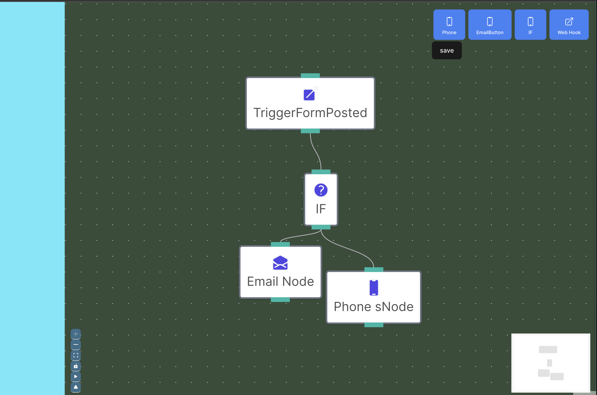

# Workflow 

FrontendMeet FlowCraft: your go-to, easy-breezy workflow wizard! It's all about making complex stuff simple with a few drags and drops. No code? No problem! With FlowCraft, anyone can whip up, tweak, and roll out workflows like a pro. It's perfect for getting your team in sync, automating the boring bits, and even building your own mini apps, all without breaking a sweat. So, if you're looking to do more with less hassle, FlowCraft's got your back. Let's make work fun again!


//add image here 
 
# Local Development

```
npm install
npm run dev 
```

# Production Deployment

```
cp .env.template .env

```

add appropiate env variables 


```
npm install
npm run build
```

- This will create /dist folder need to deploy This


```
npm install -g serve

serve ./dist
```

OR

```
npm install -g http-serve

http-serve ./dist
```


